# Zookeeper&redis高级

# 一、Zookeeper

## 1、解决什么问题？

分布式协调（中介）问题。多方，指的是分布式项目中的各个模块工程。

## 2、zookeeper基本使用

### 2.1 基本概念

zookeeper是一个树形目录服务，简称zk。树形目录最核心的就是**==节点（ZNode）==**。

节点分为以下类型：

- 持久化节点
- 临时节点 -e
- 顺序节点 -s
  - 持久化顺序节点
  - 临时顺序节点

### 2.2 节点操作

#### 2.2.1 命令操作：CRUD

```zookeeper
help 获取命令帮助

ls       查看节点 list directories 的简写，列出当前目录结构
ls 		 指定路径
ls /   	 查看根目录下节点
create   创建节点
set      修改节点数据
get      获取节点数据
delete   删除节点
deleteAll 删除所有

【技巧】：命令前三个字母+tab按两下
```

【思考】create创建节点，如果节点存在，则无法创建——分布式锁，而redis的set也是如此，了解一下什么是分布式锁、构成以及有哪几种实现方式？


#### ==2.2.2 Java API操作:CRUD==

**【通用经验】思路：**

①建项目，引入zookeeper依赖

②**==创建核心对象：==**

【经验】如何找核心对象？

1、根据引入技术的依赖，打开jar包（idea左侧External Libraries）

2、一般我们核心对象在包的最外层：查看类或者接口上的文档注释，工厂等

3、按照经验搞不定：找到当前依赖jar的对应技术手册，它会告诉你对象是什么。

4、最后如果还找不到，百度搜索 xxx技术如何操作xxx？

- 创建方法：参数节点路径、节点类型、节点数据
- 查看方法
- 删除方法
- 修改方法

③demo演示

**==【补充知识：C/S架构】：为什么我们学习一些技术时要讲先命令行、然后讲图形化和java程序？==**

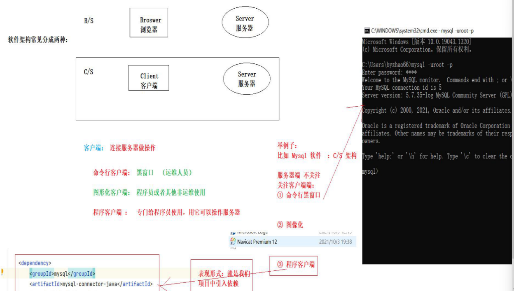

所以，作为程序员我们要研究**程序客户端，即我们引入的依赖。**

#### 2.2.3 Curator

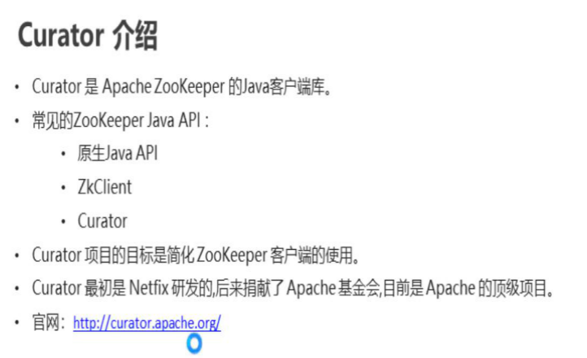


## 3、zk监控

ls -s 节点路径

在dubbo中应用比较多，dubbo封装好的。

### 3.1 watch监听：

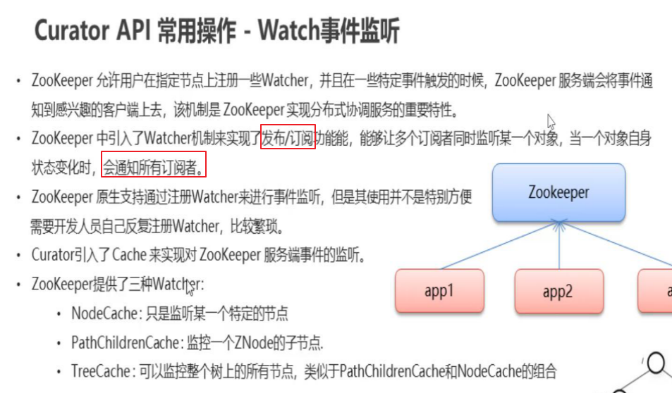

- 单个节点：NodeCache
- 某个节点子节点：PathChildCache
- 监控整个节点数：TreeCache

**代码实现参考官网examples：**

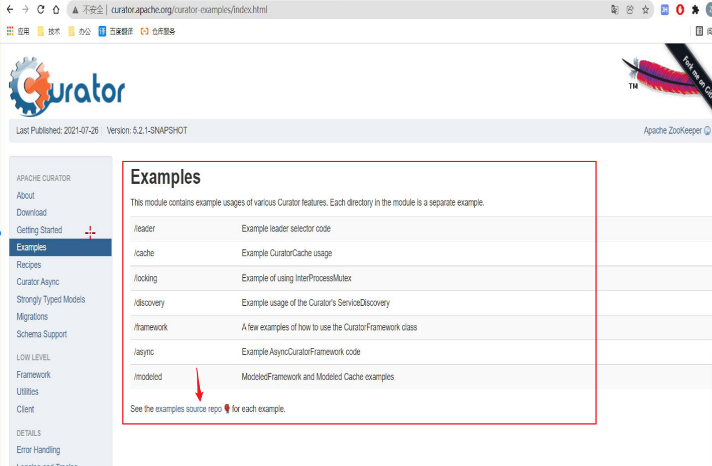

> **==注意==**：1、接口没有实现类，使用匿名对象
>
> ​			2、GitHub连不上，复制链接到gitee导入

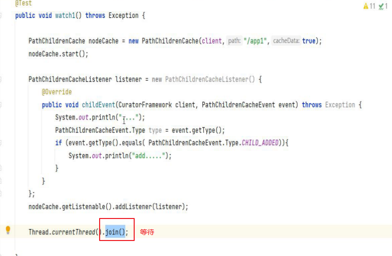


【练习】：业务场景：

以下的业务适用于数据量不大的场景，因为会增加系统的复杂性，需要维护zookeeper。

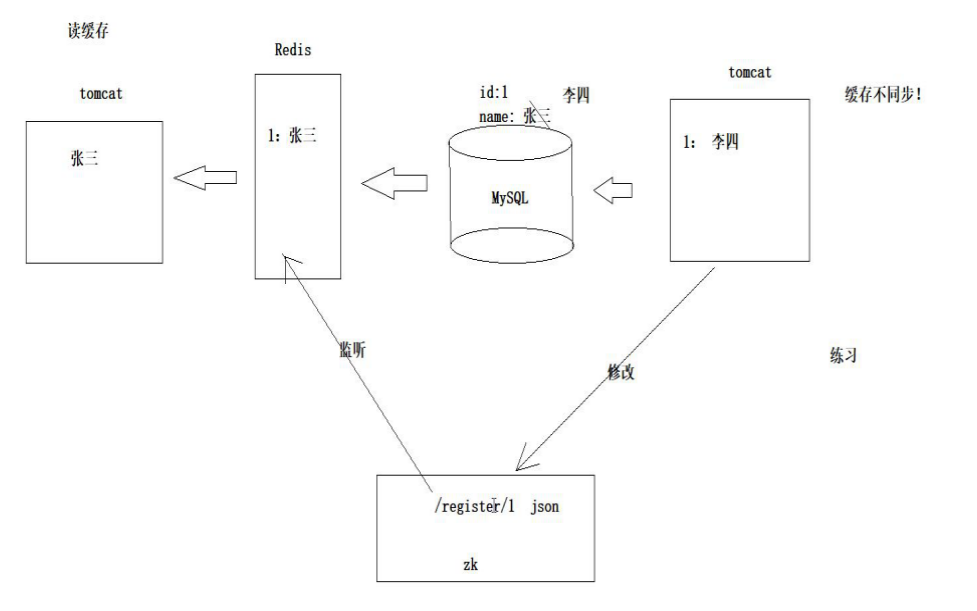

## ==4、zk分布式锁【面试必问】==

### 4.1 【回顾】Java中的锁

synchronized  同步（协调、通信）：线程之间的协调，成对出现。

monitor 管程

管程是借助锁实现的：

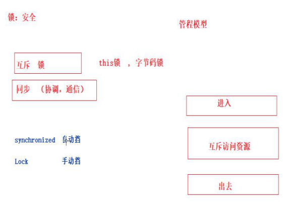

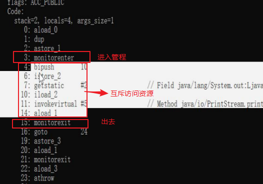

> 线程安全分为两种类型：互斥和同步。

### 4.2 分布式锁

#### 4.2.1 概念

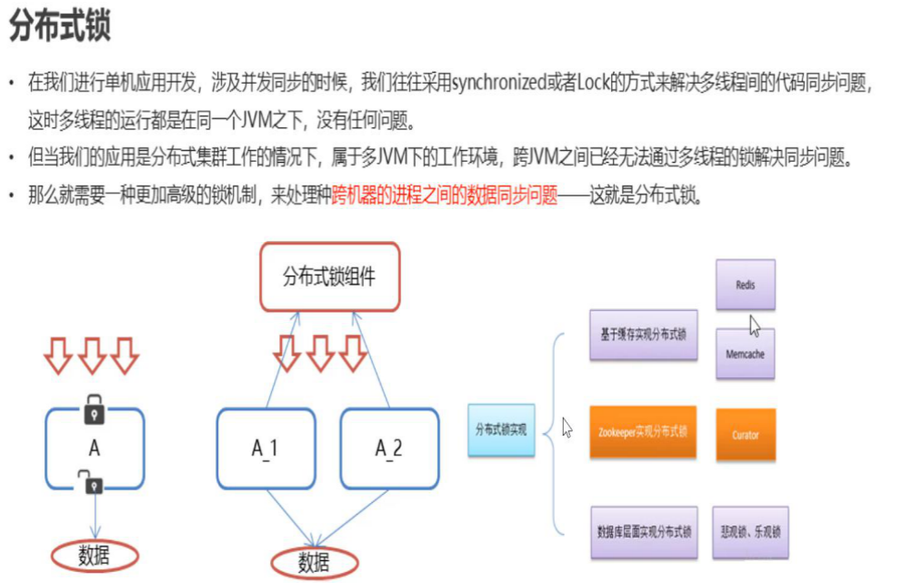

> 

#### 4.2.2 分布式锁解决什么问题？

应用于分布式项目，多个项目部署多个JVM，会产生多个进程，传统锁的机制只能解决单机应用开发，无法解决分布式应用开发问题，所以需要用分布式锁解决上述问题。这是一种【中介思想】。

#### 4.2.3 常见方案

- 数据库实现方式：可靠性高，性能最低

- redis实现方式：性能高，可靠性低——set EX

- ==zookeeper实现方式：性能较高且比较可靠==

#### ==4.2.4 如何使用？==【重要！！！】

分布式锁原理：

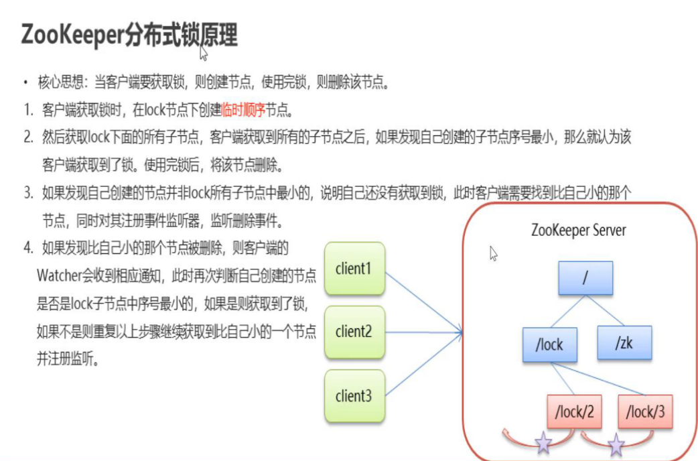

核心思想：创建节点：创建成功则获取锁，使用完成删除。

1. 创建**==临时有序==**节点：

- **临时：防止客户端出现问题，不管任何情况都可以释放锁。**

- **有序：**

​	**①性能：提升客户端连接数量，能同时放多个客户端进来；**

​	**②保证客户端获取锁的优先级，能快速找到锁，来的越早，创建节点编号越小。**

​	**③获取锁的机制：编号最小的一个客户端获取锁，剩下的节点监听比自己小的最近的一个节点。**

> 目的：学习思想！

#### 4.2.5 业务场景

- 模拟12306售票
- 秒杀场景：秒杀服务：部署2份
  - 开发一个秒杀工程，对数据库库存减1
  - 数据库表：库存表

## 5、zk集群（运维）


# ==二、redis高级【面试】==

> 没事多看官网文档

## ==1、redis缓存淘汰策略==

参考官网https://redis.io/topics/lru-cache

操作系统：页面置换算法：

- LRU 默认使用：6种
- LFU 4.0推出


## ==2、redis的key的过期策略==

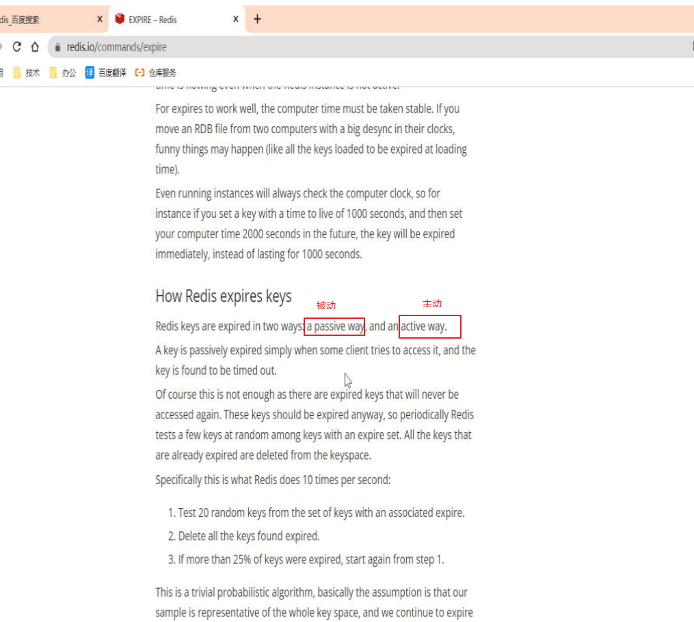

### 2.1 主动

**主动删除：**redis定期会取出设置了过期时间的key，取出以后检查这个key是否过期，如果过期则主动删除，否则不做任何操作。

### 2.2 被动

**被动删除：**redis中key的过期时间到了，但是主动删除策略还没有执行，恰好有客户端访问这个key，这个时候redis会判断这个key是否过期，过期则直接删除，返回null，这就是被动删除。

## ==3、缓存同步问题==

同步业务有很多种，要分以下两种：

### 3.1 读写业务


### 3.2 只读业务


## ==4、缓存击穿、雪崩、穿透==

### 4.1 击穿


### 4.2 雪崩


### 4.3 穿透


## 5、运维知识（了解）

### 5.1 主从复制


### 5.2 哨兵机制


### 5.3 redis集群


## 6、【回顾】redis持久化

持久化：计算机运算数据大多数暂存在内存中，把内存中的数据刷到磁盘中的过程。

redis数据存在内存中，内存的存储介质是半导体，半导体的特点是数据断电丢失，会造成数据不安全。

redis持久化的方式：

- RDB:SNAPSHOTTING 快照

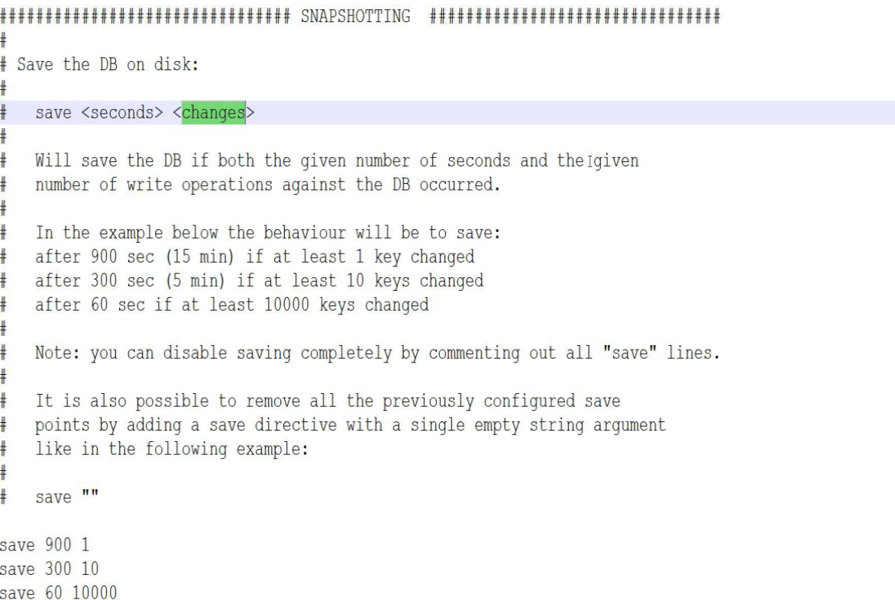

当时间在900秒以后，大于等于1个key被改变，持久化一次；

当时间在300秒以后，大于等于10个key被改变，持久化一次；

当时间在60秒以后，大于等于10000个key被改变，持久化一次；

缺点：数据可能会丢失；

优点：保存速度快。

- AOF：APPEND ONLY FILE 

客户端执行的每一个命令都会记录到一个文件中，进行数据恢复时，直接执行文件中的所有命令。

不做任何配置，丢失秒级别的数据。

> RDB默认开启，如果使用AOF则两种同时生效。
>
> 实际开发中，根据业务进行选择。如果对安全和数据完整性要求高，则开启AOF，反之默认RDB。

- **==面试题：参考redis配置文件	GitHub==**

  - **追加模式appendfsync**

    - always：数据完整性好，不过性能较差。因为写磁盘IO比较耗时。

    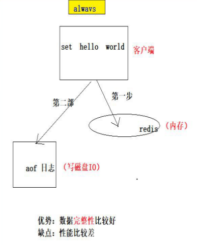

    - everysec（默认）：性能较好，但是容易丢失秒级别数据。

    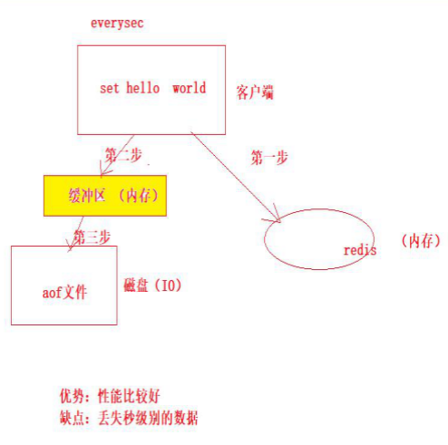

    - no：缓冲区刷数据到aof文件是随机的，取决于操作系统

    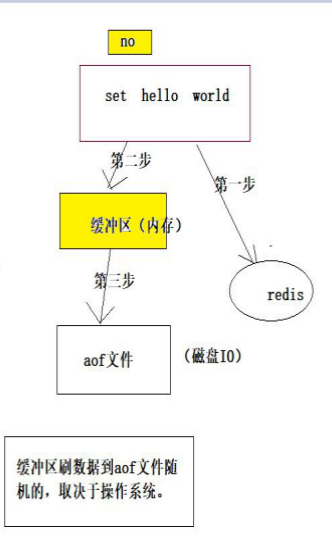

  - **Aof日志过大**

    - 日志重写
    
    auto-aof-rewrite-percentage 100
    auto-aof-rewrite-min-size 64mb