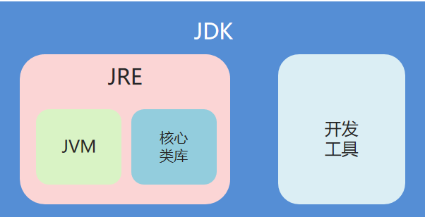
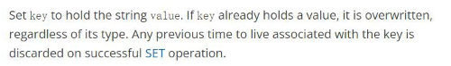
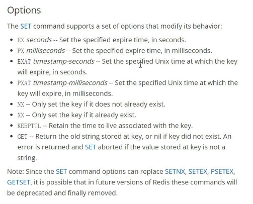
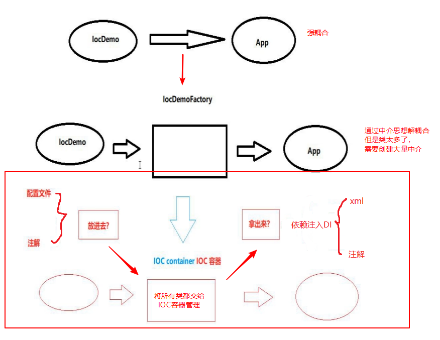
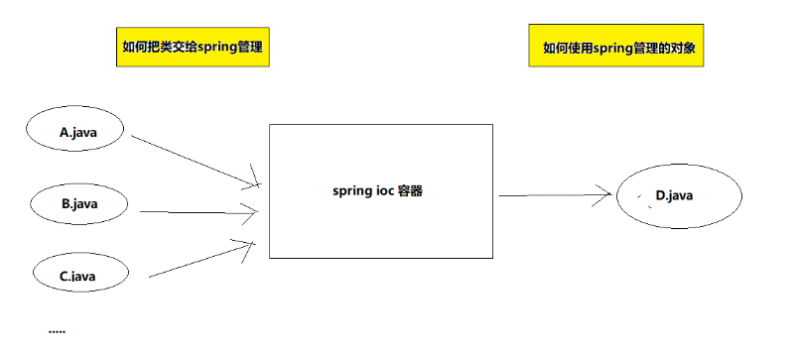

# 技术知识体系

- [ ] Java基础
- [ ] Java进阶
  - [ ] 面向对象：封装、继承、多态
  - [ ] 函数式编程
  - [ ] 集合
  - [ ] 异常
  - [ ] IO
  - [ ] 多线程
  - [ ] 反射
  - [ ] TCP/UDP

- [ ] JavaWeb
  - [ ] HTML
  - [ ] CSS
  - [ ] Tomcat
  - [ ] Servlet
  - [ ] 

## 一、编程语言

### 1、Java

​        前言：不积跬步无以至千里，不积小流无以成江海。基础不牢，地动山摇。所以在学习java技术时，一定要打好基础。

​		接下来的一个半月时间里，将对之前学习的Java知识进行一个全面完整的复盘总结。一方面对于遗忘的知识点进行一个回顾，另一方面对之前不牢固的基础进一步夯实。但是时间不等人，学习也要分清主次，对于重点知识要多花精力和时间去学习透彻，从源码入手，做到能够口述原理。对于次要的不要过多的浪费时间，一带而过。

​		同时，学习不能仅仅停留于理论层次，一定要结合实际，落到实处，以学以致用的心态去学习知识。

【自学】：1、拓展==知识宽度==

​					2、**==研究知识深度（java基础）==**：【线程、集合（源码分析）、IO（底层设计模型）、网络模型】

#### 1.1 基础语法

##### 1.1.1 java的跨平台原理

​		java是与平台无关的语言，平台无关有两种：**源代码级和目标代码级**。其中C/C++具有一定程度的源代码级平台无关，即用C/C++编写的应用程序不用修改只需重新编译就可以在不同平台上运行。而Java是依靠Java虚拟机JVM在目标代码级实现平台无关性的。

​		通过编译器，Java程序会被转换成与平台无关的字节码文件，通过Java的解释器便可以解释和运行Java的字节码。字节码是JVM的指定组，文件尺寸小，便于网络运输。其最大的好处是可跨平台运行，即Java的字节码可以编译一次，到处运行。用户使用任何一种Java编译器将Java源程序（.java）编译成字节码文件（.class）后，无论使用哪种操作系统，都可以在含有JVM的平台上运行。（JVM其实就是一个字节码解释器。）

##### 1.1.2  JRE和JDK

​		**JVM（Java Virtual Machine）：**java虚拟机、能够实现跨平台。

​		**JRE（Java Runtime Environment）：**java运行环境、包含JVM和核心类库。

​		**JDK（Java Development Kit）：**java开发工具包、包含JRE和java开发工具（翻译 javac  运行 java）

**总结：**开发和执行java程序、只需要安装jdk

​		关系图：

##### 1.1.3  java程序结构

​		一般的java源程序文件（.java）由以下三部分组成：

​			package语句（0个或1个）

​			import语句（0个或多个）

​			类定义（1个或多个）

​		package语句表示该程序所属的包，只能有一个或者没有。如果有，必须放在最前面；如果没有，表示本程序属于默认包。

​		import语句表示引入其他类库中的类。可以有0个或者多个，必须放在类定义的前面。

​		类定义是java源程序的主要部分，每个文件可以定义若干类。

其它规范：

- 每一条Java语句都以分号“;”结束。
- 出package和import语句之外其他执行具体操作的语句，都只能存在于类的{}中。
- Java严格区分大小写，使用时不能混淆。
- 一个程序可以有多个类，**但是==只能==且==必须有==一个主类**。**主类是指包含main()方法的类，是Java程序执行的入口点。**==**Tomcat的底层中包含main()方法。**==

​		main()方法是Java程序中一个特殊的方法，必须声明成public，使得在类的其他地方能够调用到它，且main()方法没有返回值，所以在它之前要加上void关键字。

##### 1.1.4 数据类型

​		**1、为什么要区分数据类型？**

​		程序在执行过程中，需要对数据进行运算或者存储。这些数据存储在内存中的一块空间，为了方便使用，用变量名来代表该数据存储空间的位置。将数据指定给变量，就是将数据存储到对应的内存空间中；调用变量，就是将内存空间中的数据取出来使用。

​		一个变量代表一个内存空间，然而由于数据在存储时所需要的内存容量不同，不同的数据就必须分配不同大小的内存空间来存储，因此需要对不同的数据用不同的数据类型来区分。

​		按照性质进行分类，数据类型定义了数据的性质，取值范围，存储方式以及对数据所能进行的运算和操作。定义了数据的类型也就相应决定了数据的性质以及对应数据的操作，同时数据也就受到类型的保护，确保对数据不进行非法操作。

​		**2、数据类型的分类**

​		Java中数据类型分为两大类：==基本数据类型（primitive types）==和==引用数据类型（reference types）==。

​		基本数据类型是程序设计语言系统所定义、不可再分的数据类型。每种基本数据类型所占内存的大小是固定的，与软硬件环境无关。

​		基本数据类型在内存中存放的数据值本身。引用数据类型在内存中存放的是指向该数据的**地址**，不是数据本身，它往往由多个基本数据类型组成，因此，对引用数据类型的应用成为对象引用，引用数据类型也被称之为符合数据类型，在有的语言中称为指针。

​		**基本数据类型：**4类8种

- 整数型：byte，short，int，long

- 浮点型：float，double

- 布尔型：boolean

- 字符型：char

  |   数据类型   |    关键字    | 占用字节 |  默认值  |    取值范围    |
  | :----------: | :----------: | :------: | :------: | :------------: |
  |    字节型    |     byte     |    1     |    0     |    -128~127    |
  |    短整型    |    short     |    2     |    0     |  -32768~32767  |
  |     整型     |  int(默认)   |    4     |    0     | -2^15~(2^15)-1 |
  |    长整型    |     long     |    8     |    0L    | -2^31~(2^31)-1 |
  | 单精度浮点型 |    float     |    4     |   0.0F   |       略       |
  | 双精度浮点型 | double(默认) |    8     |   0.0D   |       略       |
  |    布尔型    |   boolean    |    1     |  false   |  true、false   |
  |    字符型    |     char     |    2     | '\u0000' |    0~65535     |

  > 字符型采用Unicode字符集编码方案，\u表示一个Unicode值，后面的4个十六进制值表示那个Unicode字符。

  **引用数据类型：**

- 类

- 数组

- 接口

##### 1.1.5 关键字和标识符

​		**1、关键字：**Java中被赋予特定含义的一些单词。

- 关键字字母**全部小写**
- 在常用代码编辑器中，有特殊颜色标记。

> 注意：main不是关键字

​		

​		

​		

#### 1.2 流程控制

## 二、Redis

redis是一个key-value的存储结构。

### 1、redis的==value==五种常用数据类型

#### 1.1 应用场景：

**String：**简单的值不涉及复杂结果，验证码；

**Hash：**涉及归类，比如：设计购物车，根据用户id归类

**Set：**注册（防止用户名重复），把用户注册的用户名放在一个Set集合中，如果能够放进去，说明该用户名未注册，如果不能放进去，说明用户名已存在。

**List：**索引，可重复，可以用作**队列**。

**SortSet：**排序，分数。比如：双十一订单，根据订单金额排序。订单支付完成后，需要把订单id作为sortset元素（key）存储，订单金额作为分数（value）。

### 2、开发常用：

#### 2.1 发布和订阅

应用场景：微信公众号发布订阅等

##### 2.1.1 发布

publish channel message

##### 2.1.2 订阅

subscribe channel message

#### 2.2 锁

锁是一种资源，保证唯一性。

**①早期：**

早期redis提供一个setnx+expire模拟锁，容易导致锁竞争。

例：

A线程  setnx lock test    返回值1  获取锁成功

​			[expire lock 1000]

B线程  setnx  lock test   返回值0   获取锁失败

​		这样容易造成一种问题，如果A线程一直不释放锁，造成其它线程一直在等待，所以还需要给lock设置过期时间，比如**expire lock 1000** 设置过期时间为1000ms，则1s后，这个锁自动释放掉，即这个锁在1s后就不存在了，其它线程就能拿到这个锁了，但是两个命令破坏了原子性。

**②现在：**

现在玩redis的锁，直接用set，因为原子性，可以避免锁拆解和防止死锁。

SET key value EX 时间(秒) NX(表示是否存在)        原子性

  如果这个key存在，我们就不需要操作，如果key不存在，我们就获取了这个锁 。

#### 2.3 事务

redis的事务是伪事务，如果想真正使用redis事务，基于lua脚本(基于C的脚本)。

## 三、Spring

### 1、Spring Framework

#### 1.1 前言

##### 1.1.1 spring解决什么问题？

- Java类的管理（bean管理）。早期时，java中类的管理都是由程序员自己控制。
- 整合 integration：spring没有出现之前，框架之间进行配合使用的时候很繁琐。

##### 1.1.2 spring是什么？

spring是开源的轻量级full-stack（一站式）框架。

轻量级：占用资源比较少。计算机中资源一般指：内存，CPU，磁盘，网络带宽等。

##### 1.1.3 spring怎么使用？

IOC：xml，==注解==

AOP：xml，==注解方式开发==；基于AOP的声明式事务==@Transactional==

#### 1.2 IOC

##### 1.2.1 IOC容器的演变

**==spring开发核心：①把java类交给spring容器管理；②从容器中获取对象(Bean)==**

##### 1.2.2 什么是IOC？

IOC (Inversion of Control)就是控制反转，它把传统上由程序代码直接操控的对象的调用权交给容器，通过容器来实现对象组件的装配和管理。所谓的“控制反转”概念就是对组件对象控制权的转移，从程序代码本身转移到了外部容器。**即把创建对象的权力交给了Spring。**

##### 1.2.3 IOC有什么用？

Spring IOC 负责创建对象，管理对象（通过依赖注入（DI），装配对象，配置对象，并且管理这些对象的整个生命周期。方便解耦，由容器去维护具体的对象。

##### 1.2.4 IOC：XML开发

##### 1.2.5 IOC：注解开发

### 2、Spring MVC

### 3、Spring Boot

### 4、Spring Data JPA

四、 JavaWeb